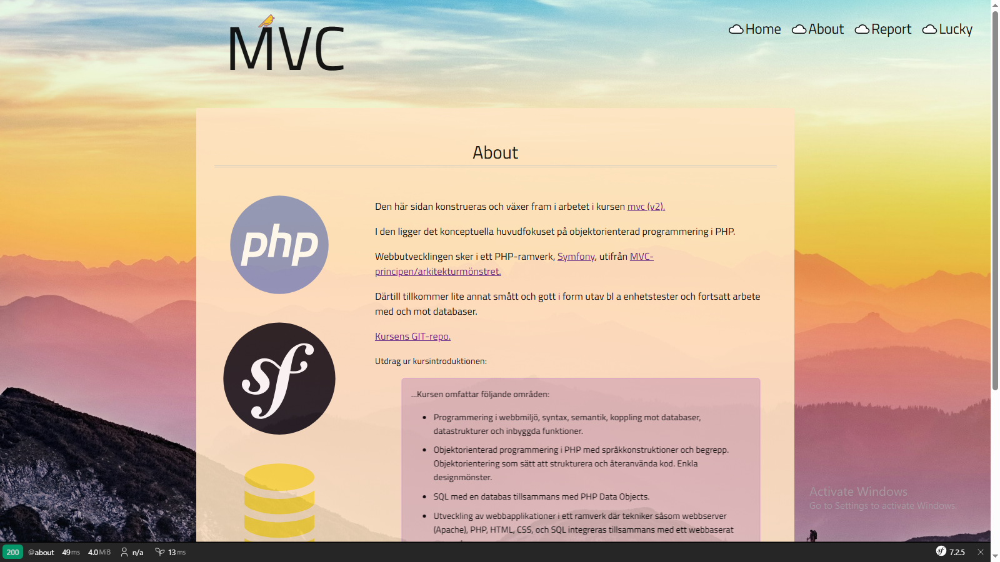

<!--
---
author: hekr23
revision:
    "2025-04-15": "(A, hekr23) First release."
---
-->


MVC REPORT - A SYMFONY BUILD.
====================


Greetings!



Welcome to this repo that contains my, [Herman Karlsson, hekr23](https://www.student.bth.se/~hekr23/dbwebb-kurser/mvc/me/report/public/), mvc-report-build, established in and for the course [mvc v2](https://dbwebb.se/kurser/mvc-v2).

Now, before outlining how you would go about and cloning and setting up this repo locally to be able to peruse it in detail, I'd advice you to first of all considering building your own Symfony-project from scratch: much more fun, much more rewarding.

If you would like to do this, please consult this thorough guide, composed by mos:

[Get going with Symfony](https://github.com/dbwebb-se/mvc/tree/main/example/symfony)


...in relation to the [course-repo](https://github.com/dbwebb-se/mvc/)

...there is also a video of Mikael (mos) walking one through all the steps of the exercise, if that is preferred:

[](https://www.youtube.com/watch?v=1QVvLGNqTxw)

...or, for a more general, generic Symfony-setup, consult: [Create your first page in Symfony](https://symfony.com/doc/current/page_creation.html).


Alas, perhaps you are already familiar with all of this, or, for whatever reason, are only interested in taking a look at this specific build. Granted. I'm honored!


Prerequisites
----------------------------

You have installed PHP in the terminal.

You have installed Composer, the PHP package manager.


What you need to do:
----------------------------

Fist: Clone the repo.

Second: In the resulting cloned project's root folder, run 'composer install' in your terminal of choice.

```bash
# You are in the root report/ directory
composer install
```

Third: In the project's root folder, run 'symfony server:start' to get the site running on a local development server. The project's root "/"-destination should now (with default-settings) be accessible at: https://127.0.0.1:8000.

```bash
# You are in the root report/ directory
symfony server:start
```

If you for any reason are encountering any problems, maybe https/handshake-related, and can not for the moment be bothered with troubleshooting, an alternative approach is to start a php-server instead, by executing the terminal command 'php -S localhost:8888 -t public' (again, of course, to be redundant, in the root project's folder).

```bash
# You are in the root report/ directory
php -S localhost:8888 -t public
```

It should now be accessible at localhost:8888 instead.

Up and running
----------------------------

You should now be able to examine the build in all its glory.

If you are nevertheless still encountering problems, I'd advice you to read through the previously mentioned [thorough guide](https://github.com/dbwebb-se/mvc/tree/main/example/symfony) for clues as to what might be going wrong.

Further Reading
----------------------------
Intrigued? Want to learn more about Symfony, Twig and all these other marvellous creations?

Here are some links to satisfy your appetite:

[Symfony 6 Introductory Book - The Fast Track (English)](https://symfony.com/doc/6.4/the-fast-track/en/index.html)

[Symfony - Doc Index](https://symfony.com/doc/current/index.html)

[Symfony - Controller](https://symfony.com/doc/current/controller.html)

[Symfony - Routing](https://symfony.com/doc/current/routing.html)

[Twig for Template Designers](https://twig.symfony.com/doc/3.x/templates.html)

Final words
----------------------------

I hope that you will find all of this intriguing and rewarding.

In need of a pick me up, and you are finding the additional cups of coffee wanting? Go grab some [Groucho Marx quotes at the api/quote-route](https://www.student.bth.se/~hekr23/dbwebb-kurser/mvc/me/report/public/api/quote), from this very build, conveniently already published on the student server.

/ Best regards, Herman